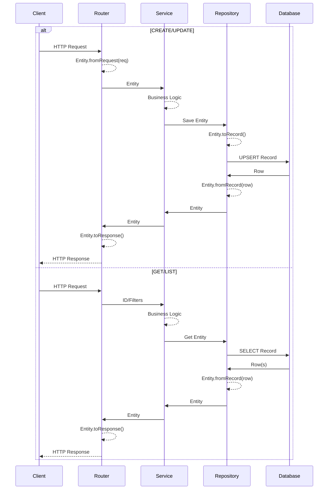

# Stub-Driven TDD Implementation Guide

## Implementation Process

### Phase 1: Stub Creation
Create skeleton implementations for all components with proper method signatures:

```javascript
class UserService {
  constructor(repo, eventBus) {
    this.repo = repo;
    this.eventBus = eventBus;
  }

  async get(id) {
    throw new Error("Not Implemented");
  }

  async create(entity) {
    throw new Error("Not Implemented");
  }
}
```

**Benefits:**
- Immediate visibility of system structure
- Clear dependency relationships via constructors
- Early detection of integration issues
- Enables parallel development
- Type checking works immediately

### Phase 2: Test Writing (Red)
Write tests that define expected behavior against the stubs:

```javascript
describe("UserService", () => {
  it("should create user with valid data", async () => {
    const mockRepo = {
      list: jest.fn().mockResolvedValue([]),
      create: jest.fn().mockResolvedValue(savedEntity)
    };
    const mockEventBus = { publish: jest.fn() };
    const service = new UserService(mockRepo, mockEventBus);

    // Currently throws "Not Implemented"
    await expect(service.create(entity))
      .rejects.toThrow("Not Implemented");

    // Document expected behavior for implementation
    // When implemented, should:
    // 1. Check for duplicate email via repo.list
    // 2. Call repo.create with entity
    // 3. Publish event via eventBus
    // 4. Return saved entity
  });
});
```

### Phase 3: Implementation (Green)
Replace stub with actual logic to make tests pass:

```javascript
async create(entity) {
  // Business validation
  const existing = await this.repo.list({ email: entity.email });
  if (existing.length > 0) {
    throw new ConflictError('Email already exists');
  }

  // Persist via repository
  const saved = await this.repo.create(entity);

  // Publish event
  await this.eventBus.publish('user.created', saved);

  return saved;
}
```

## Stub Patterns

### Entity Stubs
```javascript
class User {
  static fromRequest(data) { throw new Error("Not Implemented"); }
  static fromRecord(record) { throw new Error("Not Implemented"); }
  toRecord() { throw new Error("Not Implemented"); }
  toResponse() { throw new Error("Not Implemented"); }
}
```

### Repository Stubs
```javascript
class UserRepository {
  constructor(db) {
    this.db = db;
  }

  async getUser(id) { throw new Error("Not Implemented"); }
  async listUsers(filters) { throw new Error("Not Implemented"); }
  async createUser(entity) { throw new Error("Not Implemented"); }
  async updateUser(id, entity) { throw new Error("Not Implemented"); }
  async deleteUser(id) { throw new Error("Not Implemented"); }
}
```

### Service Stubs
```javascript
class UserService {
  constructor(repo, eventBus) {
    this.repo = repo;
    this.eventBus = eventBus;
  }

  async getUser(id) { throw new Error("Not Implemented"); }
  async listUsers(filters) { throw new Error("Not Implemented"); }
  async createUser(entity) { throw new Error("Not Implemented"); }
  async updateUser(id, entity) { throw new Error("Not Implemented"); }
  async deleteUser(id) { throw new Error("Not Implemented"); }
}
```

### Router Stubs
```javascript
class UserRouter {
  private readonly router: Router;

  constructor(service) {
    this.service = service;
    this.router = this.createRoutes();
  }

  createRoutes() {
    const router = express.Router();

    router.get('/:id', this.get.bind(this));
    router.get('/', this.list.bind(this));
    router.post('/', this.create.bind(this));
    router.put('/:id', this.update.bind(this));
    router.delete('/:id', this.delete.bind(this));

    return router;
  }

  async getUser(req, res) { throw new Error("Not Implemented"); }
  async listUsers(req, res) { throw new Error("Not Implemented"); }
  async createUser(req, res) { throw new Error("Not Implemented"); }
  async updateUser(req, res) { throw new Error("Not Implemented"); }
  async deleteUser(req, res) { throw new Error("Not Implemented"); }
}
```

## Data Flow Implementation Order

Follow the natural request path through the system:



### 1. Router Layer
**Purpose:** HTTP handling, request/response transformation
```javascript
// Stub
class UserRouter {
  constructor(service) {
    this.service = service;
  }

  async create(req, res) {
    throw new Error("Not Implemented");
  }
}

// Implementation
class UserRouter {
  constructor(service) {
    this.service = service;
  }

  async create(req, res) {
    try {
      const entity = User.fromRequest(req.body);
      const result = await this.service.create(entity);
      res.status(201).json(result.toResponse());
    } catch (error) {
      res.status(error.status || 500).json({ error: error.message });
    }
  }
}
```

### 2. Service Layer
**Purpose:** Business logic orchestration, transaction management
```javascript
// Stub
class UserService {
  constructor(repo, eventBus) {
    this.repo = repo;
    this.eventBus = eventBus;
  }

  async create(entity) {
    throw new Error("Not Implemented");
  }
}

// Implementation
class UserService {
  constructor(repo, eventBus) {
    this.repo = repo;
    this.eventBus = eventBus;
  }

  async create(entity) {
    // Business validation
    const existing = await this.repo.list({ email: entity.email });
    if (existing.length > 0) {
      throw new ConflictError('Email already exists');
    }

    // Create through repository
    const saved = await this.repo.create(entity);

    // Publish events
    await this.eventBus.publish('user.created', saved);

    return saved;
  }
}
```

### 3. Repository Layer
**Purpose:** Data persistence, Entity/database transformation
```javascript
// Stub
class UserRepository {
  constructor(db) {
    this.db = db;
  }

  async create(entity) {
    throw new Error("Not Implemented");
  }
}

// Implementation
class UserRepository {
  constructor(db) {
    this.db = db;
  }

  async create(entity) {
    const record = entity.toRecord();
    const [row] = await this.db('users')
      .insert(record)
      .returning('*');
    return User.fromRecord(row);
  }

  async get(id) {
    const row = await this.db('users')
      .where({ id })
      .first();
    if (!row) throw new NotFoundError('User not found');
    return User.fromRecord(row);
  }

  async list(filters = {}) {
    const rows = await this.db('users')
      .where(filters)
      .select('*');
    return rows.map(row => User.fromRecord(row));
  }

  async update(id, entity) {
    const record = entity.toRecord();
    const [row] = await this.db('users')
      .where({ id })
      .update(record)
      .returning('*');
    if (!row) throw new NotFoundError('User not found');
    return User.fromRecord(row);
  }

  async delete(id) {
    const deleted = await this.db('users')
      .where({ id })
      .delete();
    if (!deleted) throw new NotFoundError('User not found');
    return true;
  }
}
```

### 4. Entity Layer
**Purpose:** Domain model, data transformation, validation
```javascript
// Stub
class User {
  static fromRequest(data) {
    throw new Error("Not Implemented");
  }
}

// Implementation
class User {
  constructor(data) {
    this.id = data.id;
    this.email = data.email;
    this.name = data.name;
    this.createdAt = data.createdAt;
    this.updatedAt = data.updatedAt;
  }

  static fromRequest(data) {
    return new User({
      email: data.email?.toLowerCase(),
      name: data.name?.trim(),
      createdAt: new Date(),
      updatedAt: new Date()
    });
  }

  static fromRecord(record) {
    return new User({
      id: record.id,
      email: record.email,
      name: record.name,
      createdAt: new Date(record.created_at),
      updatedAt: new Date(record.updated_at)
    });
  }

  toRecord() {
    return {
      email: this.email,
      name: this.name,
      created_at: this.createdAt,
      updated_at: this.updatedAt
    };
  }

  toResponse() {
    return {
      id: this.id,
      email: this.email,
      name: this.name
    };
  }
}
```

## Dependency Injection

Wire dependencies together at application startup:

```javascript
// app.js
class App {
  constructor(config) {
    // Database connection
    this.db = knex(config.database);

    // Event bus
    this.eventBus = new EventBus();

    // Repository layer
    this.userRepo = new UserRepository(this.db);

    // Service layer
    this.userService = new UserService(this.userRepo, this.eventBus);

    // Router layer
    this.userRouter = new UserRouter(this.userService);

    // Express app
    this.express = express();
    this.express.use('/users', this.userRouter.router);
  }

  async start(port) {
    await this.db.migrate.latest();
    this.express.listen(port);
  }
}

// Start application
const app = new App(config);
await app.start(3000);
```

## Testing Strategy

Each layer tests its own responsibilities with clear boundaries:
- **Mock what's above** (dependencies you call)
- **Use real implementations below** (what you are)

Entities are tested through their usage in Service and Repository tests - no separate Entity tests needed.

### Router Tests
Test HTTP handling and Entity transformation, mock Service:

```javascript
describe('UserRouter', () => {
  let router;
  let mockService;
  let req, res;

  beforeEach(() => {
    mockService = {
      create: jest.fn(),
      get: jest.fn(),
      list: jest.fn(),
      update: jest.fn(),
      delete: jest.fn()
    };
    router = new UserRouter(mockService);

    req = { body: {}, params: {}, query: {} };
    res = {
      status: jest.fn().mockReturnThis(),
      json: jest.fn()
    };
  });

  describe('create', () => {
    it('should transform request and response', async () => {
      req.body = { email: 'TEST@EXAMPLE.COM', name: '  Test User  ' };

      const savedEntity = new User({
        id: 1,
        email: 'test@example.com',
        name: 'Test User'
      });

      mockService.create.mockResolvedValue(savedEntity);

      await router.create(req, res);

      // Verify Entity.fromRequest was used (normalized data)
      expect(mockService.create).toHaveBeenCalledWith(
        expect.objectContaining({
          email: 'test@example.com',
          name: 'Test User'
        })
      );

      // Verify Entity.toResponse was used
      expect(res.status).toHaveBeenCalledWith(201);
      expect(res.json).toHaveBeenCalledWith({
        id: 1,
        email: 'test@example.com',
        name: 'Test User'
      });
    });
  });
});
```

### Service Tests
Test business logic with Entity objects, mock Repository:

```javascript
describe('UserService', () => {
  let service;
  let mockRepo;
  let mockEventBus;

  beforeEach(() => {
    mockRepo = {
      get: jest.fn(),
      list: jest.fn(),
      create: jest.fn(),
      update: jest.fn(),
      delete: jest.fn()
    };
    mockEventBus = {
      publish: jest.fn()
    };
    service = new UserService(mockRepo, mockEventBus);
  });

  describe('create', () => {
    it('should create entity and publish event', async () => {
      const inputEntity = new User({
        email: 'test@example.com',
        name: 'Test User'
      });

      const savedEntity = new User({
        id: 1,
        email: 'test@example.com',
        name: 'Test User'
      });

      mockRepo.list.mockResolvedValue([]);
      mockRepo.create.mockResolvedValue(savedEntity);

      const result = await service.create(inputEntity);

      expect(mockRepo.list).toHaveBeenCalledWith({ email: 'test@example.com' });
      expect(mockRepo.create).toHaveBeenCalledWith(inputEntity);
      expect(mockEventBus.publish).toHaveBeenCalledWith('user.created', savedEntity);
      expect(result).toBe(savedEntity);
    });

    it('should reject duplicate email', async () => {
      const entity = new User({
        email: 'existing@example.com',
        name: 'Test'
      });

      mockRepo.list.mockResolvedValue([entity]);

      await expect(service.create(entity))
        .rejects.toThrow('Email already exists');

      expect(mockRepo.create).not.toHaveBeenCalled();
    });
  });
});
```

### Repository Tests
Test Entity/database transformation with real database:

```javascript
describe('UserRepository', () => {
  let repo;
  let db;

  beforeAll(async () => {
    db = await setupTestDatabase();
    repo = new UserRepository(db);
  });

  beforeEach(async () => {
    await db('users').truncate();
  });

  afterAll(async () => {
    await db.destroy();
  });

  describe('create', () => {
    it('should transform entity to record and back', async () => {
      const entity = new User({
        email: 'test@example.com',
        name: 'Test User'
      });

      const saved = await repo.create(entity);

      // Verify Entity.toRecord worked (snake_case in DB)
      const record = await db('users').where({ id: saved.id }).first();
      expect(record.created_at).toBeDefined();
      expect(record.updated_at).toBeDefined();

      // Verify Entity.fromRecord worked (camelCase in Entity)
      expect(saved).toBeInstanceOf(User);
      expect(saved.id).toBeDefined();
      expect(saved.createdAt).toBeInstanceOf(Date);
    });
  });

  describe('get', () => {
    it('should retrieve entity by id', async () => {
      const entity = new User({
        email: 'test@example.com',
        name: 'Test User'
      });

      const created = await repo.create(entity);
      const retrieved = await repo.get(created.id);

      expect(retrieved).toBeInstanceOf(User);
      expect(retrieved.id).toBe(created.id);
      expect(retrieved.email).toBe('test@example.com');
    });

    it('should throw NotFoundError for invalid id', async () => {
      await expect(repo.get(999))
        .rejects.toThrow('User not found');
    });
  });

  describe('list', () => {
    it('should return array of entities', async () => {
      await repo.create(new User({ email: 'user1@example.com', name: 'User 1' }));
      await repo.create(new User({ email: 'user2@example.com', name: 'User 2' }));

      const users = await repo.list();

      expect(users).toHaveLength(2);
      expect(users[0]).toBeInstanceOf(User);
      expect(users[1]).toBeInstanceOf(User);
    });
  });
});
```

## Testing Principles

1. **Test behavior, not implementation** - Focus on what the component does, not how
2. **Test through usage** - Entity behavior is tested through Service and Repository tests
3. **Clear boundaries** - Each test suite knows exactly what it's testing
4. **Fast feedback** - Router and Service tests run without database
5. **Real validation** - Repository tests use actual database constraints
6. **No test categories** - Just tests that verify the system works

## Coverage Goals

- Each component: 80%+ coverage
- Critical paths: 100% coverage
- Error handling: All paths tested
- Overall system: 85%+ coverage
