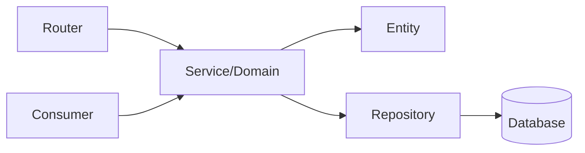
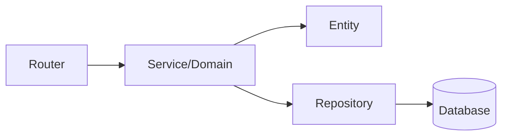
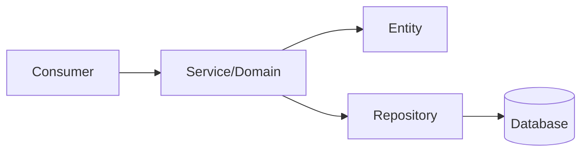
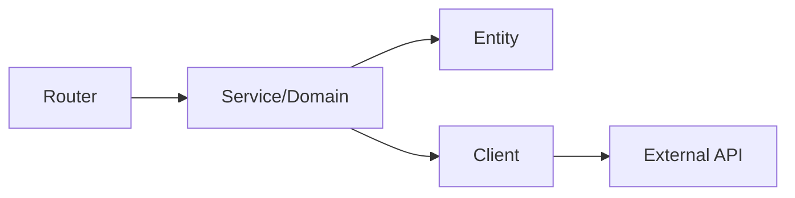

# {{feature}} Technical Design

## Architecture Pattern

{{#if design.endpoints}}
{{#if design.events}}
### Hybrid (API + Events)

{{else}}
### Standard CRUD API

{{/if}}
{{else if design.events}}
### Event-Driven

{{else}}
### Service Integration

{{/if}}

## Domain Model

### Core Entity: {{feature}}Entity

**Methods:**
- `fromRequest(dto)` - Validate and transform API input
- `toRecord()` - Convert to database format
- `toResponse()` - Format for API output
- `validate()` - Enforce business rules

{{#if design.domain_model.services}}
### Services
{{#each design.domain_model.services}}
- **{{@key}}**: {{this}}
{{/each}}
{{/if}}

{{#if design.database}}
## Data Persistence

**Table**: `{{design.database.table}}`

**Schema:**
```sql
{{design.database.schema}}
```

{{#if design.database.indexes}}
**Indexes:**
{{#each design.database.indexes}}
- {{this}}
{{/each}}
{{/if}}
{{/if}}

{{#if design.endpoints}}
## API Endpoints

{{#each design.endpoints}}
- **{{@key}}**: {{this}}
{{/each}}
{{/if}}

{{#if design.events}}
## Events

{{#if design.events.publishes}}
**Publishes:**
{{#each design.events.publishes}}
- {{this}}
{{/each}}
{{/if}}

{{#if design.events.subscribes}}
**Subscribes:**
{{#each design.events.subscribes}}
- {{this}}
{{/each}}
{{/if}}
{{/if}}

{{#if dependencies}}
## Dependencies

{{#if dependencies.internal}}
**Internal:**
{{#each dependencies.internal}}
- {{@key}}: {{this}}
{{/each}}
{{/if}}

{{#if dependencies.external}}
**External:**
{{#each dependencies.external}}
- {{@key}}: {{this}}
{{/each}}
{{/if}}
{{/if}}
